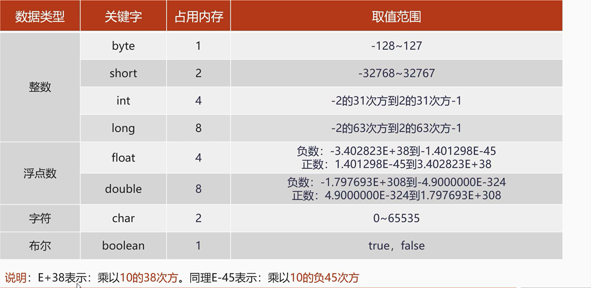
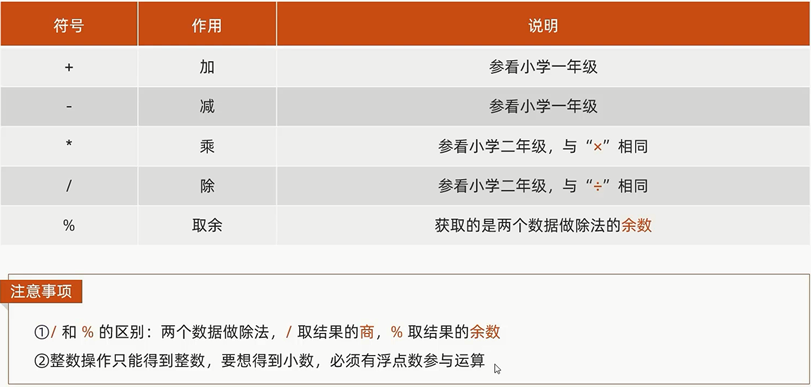
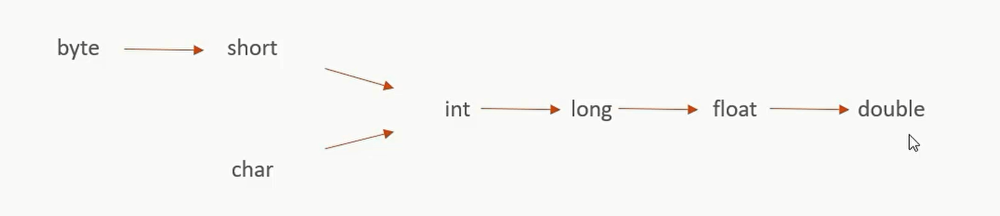
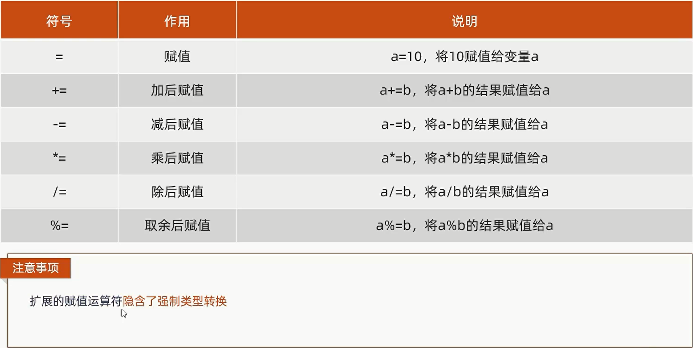
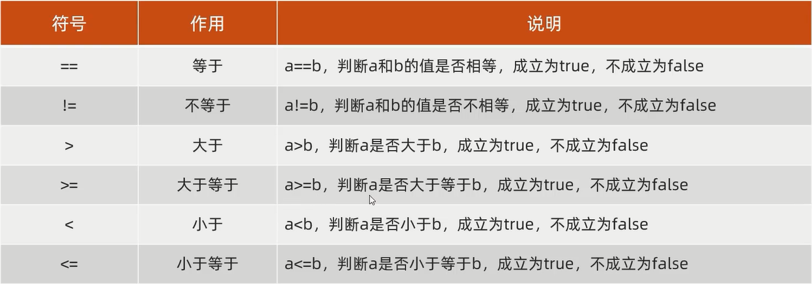
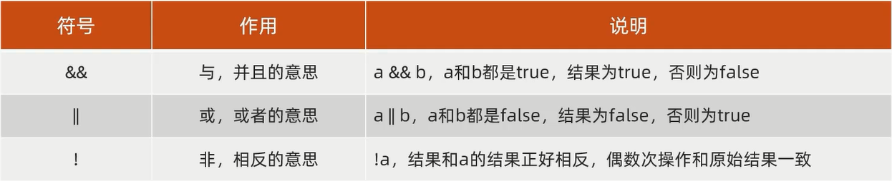

# 基础语法

## 字面量

字面量就是直接写出来的，人可以理解的数据。

字面量的分类：

| 字面量类型  | 说明         | 举例                    |
| ------ | ---------- | --------------------- |
| 字符串字面量 | 用双引号括起来的内容 | "Hello World"，"黑马程序员" |
| 整数字面量  | 不带小数的数字    | 666，-88               |
| 小数字面量  | 带小数的数字     | 13.14，-5.21           |
| 字符字面量  | 用单引号括起来的内容 | 'A'，'0'，'我'           |
| 布尔字面量  | 布尔值，表示真假   | true，false            |

## 数据类型

### 数据类型的内存占用和取值范围



## 变量

### 使用

+ 格式：数据类型 变量名 = 变量值;

+ 范例：int price = 998;

### 注意事项

+ 变量名不能重复

+ 变量未赋值不能使用

+ 定义long类型变量，数据后面加L

+ 定义float类型变量，数据后面加F

## 运算符

### 算术运算符



#### 隐式转换

把一个表示数据范围小的数值或者变量赋值给另一个表示数据范围大的变量。



#### 强制转换

把一个表示数据范围大的数值或者变量赋值给另一个表示数据范围小的变量。

格式：数据类型 变量名 = (目标数据类型)(数值或变量)

#### 字符相加

拿字符在计算机底层对应的数值来进行计算的

#### 字符串相加

+ 当“+”操作中出现字符串时，这个“+”是**字符串连接符**，而不是算术运算符。

+ 当连续进行“+”操作时，**从左到右逐个执行**。

### 赋值运算符



### 关系运算符



### 逻辑运算符



### 三元运算符

**格式：** 关系表达式 ? 表达式1 : 表达式2;

**运算规则：** 首先计算**关系表达式**的值，如果值为true，表达式1的值就是运算结果，如果值为false，表达式2的值就是运算结果。

## 流程控制语句

### 选择结构

选择结构  

#### IF 语句

格式1：

```   
if(结果为boolean类型的表达式){
    语句体1;
}else if{
    语句体2;
}else{
    语句体3;
}
```

#### switch 语句

```
switch(表达式){
    case 值1:
        语句体1;
        break;
    case 值2:
        语句体2;
        break;
    ...
    default:
        语句体n+1;
        break;
} 
```

格式说明：

+ 表达式：可以是byte类型，short类型，int类型，char类型，JDK5之后可以是枚举类型，JDK7之后可以是String类型。

+ case：后面跟的是要和表达式进行比较的值。

+ break：表示中断，结束的意思。用来结束switch语句。

+ default：所有值都不匹配的时候，执行该处内容。和if语句的else相似。

::: warning

在switch语句中，如果case控制的语句体后面不写break，将出现穿透现象，在不判断下一个case值的情况下，向下运行，直到遇到break，或者整个switch语句结束。

:::

### 循环结构

+ for循环语句

+ while循环语句

+ do...while循环语句

#### for 循环语句

```
for(初始化语句;条件判断语句;条件控制语句){
    循环体语句;
}
```

+ 初始化语句：这里可以是一条或者多条语句，这些语句用来完成初始化操作。

+ 条件判断语句：这里使用一个结果值为boolean类型的表达式，这个表达式能决定是否执行循环体语句。

+ 循环体语句：这里可以是任意语句，这些语句可能被多次执行。

+ 条件控制语句：这里通常是使用一条语句来改变变量的值，从而达到控制循环是否继续向下执行的效果。

#### while 循环语句

```
初始化语句;
while(条件判断语句){
    循环体语句;
    条件控制语句;
}
```

#### do...while 循环语句

```
do{
    循环体语句;
    条件控制语句;
}while(条件判断语句);
```

## 跳转控制语句

+ **continue**：用在循环中，基于条件控制，跳过某次循环体内容的执行，继续下一次的执行。

+ **break**：用在循环中，基于条件控制，终止循环体内容的执行，也就是说结束当前的整个循环。

## 方法

方法（method）：就是完成特定功能的代码块。    

### 方法的定义及调用

方法的定义

```java
public static 返回值类型 方法名(数据类型 变量名1, 数据类型 变量名2, ...) {
    方法体;
    return 数据;
}
```

+ public static：修饰符。

+ 返回值类型：方法操作完毕之后返回的数据的数据类型，如果方法操作完毕，没有数据返回，这里写void，而且方法体中一般不写return。

+ 方法名：调用方法时候使用的标识。

+ 参数：由数据类型和变量名组成，多个参数之间用逗号隔开。

方法的调用

```
方法名();
```

### 方法注意事项

+ 方法不能嵌套定义。

+ void表示无返回值，可以省略return，也可以单独的书写return，后面不加数据。
