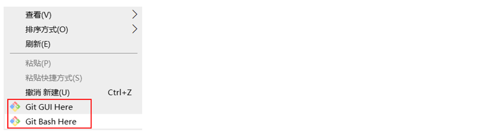
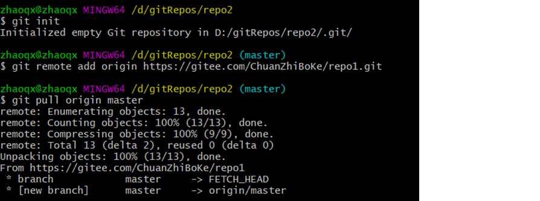

# Git

[[toc]]


## 简介

Git是一个分布式版本控制工具，通常用来对软件开发过程中的源代码文件进行管理。通过Git仓库来存储和管理这些文件，Git仓库分为两种：

+ 本地仓库：开发人员自己电脑上的Git仓库。
+ 远程仓库：远程服务器上的Git仓库。

<br/>

<div align=center></div>

<br/>

+ **commit**：提交，将本地文件和版本信息保存到本地仓库。
+ **push**：推送，将本地仓库文件和版本信息上传到远程仓库。
+ **pull**：拉取，将远程仓库文件和版本信息下载到本地仓库。

## 下载与安装

下载地址：https://git-scm.com/download

安装完成后可以在任意目录下点击鼠标右键，如果能够看到如下菜单则说明安装成功：



+ Git GUI Here：打开Git图形界面
+ Git Bash Here：打开Git命令行

## Git 代码托管服务

Git中存在两种类型的仓库，即**本地仓库**和**远程仓库**。那么我们如何搭建Git**远程仓库**呢？

我们可以借助互联网上提供的一些代码托管服务来实现，其中比较常用的有GitHub、码云、GitLab等。

常用的Git代码托管服务：

| 名称      | 网址                      | 说明                                                         |
| --------- | ------------------------- | ------------------------------------------------------------ |
| GitHub    | https://github.com/       | 一个面向开源及私有软件项目的托管平台，因为只支持Git 作为唯一的版本库格式进行托管，故名gitHub |
| 码云      | https://gitee.com/        | 国内的一个代码托管平台，由于服务器在国内，所以相比于GitHub，码云速度会更快 |
| GitLab    | https://about.gitlab.com/ | 一个用于仓库管理系统的开源项目，使用Git作为代码管理工具，并在此基础上搭建起来的web服务 |
| BitBucket | https://bitbucket.org/    | 一家源代码托管网站，采用Mercurial和Git作为分布式版本控制系统，同时提供商业计划和免费账户 |

## Git 全局设置

当安装Git后首先要做的事情是设置用户名称和email地址。这是非常重要的，因为每次Git提交都会使用该用户信息。

在Git命令行中执行下面命令：

+ 设置用户信息

```shell
git config --global user.name "itcast"
git config --global user.email "hello@itcast.cn"
```

+ 查看配置信息

```shell
git config --list
```

::: tip 

上面设置的user.name和user.email并不是我们在注册代码托管平台（GitHub，码云等）时使用的用户名和邮箱，此处可以任意设置。

:::

## Git 仓库获取

要使用Git对我们的代码进行版本控制，首先需要获得Git仓库，获取Git仓库通常有两种方式：

+ 从本地初始化一个Git仓库
+ 从远程仓库克隆（常用）

### 本地初始化Git仓库

执行步骤如下：

1. 在任意目录下创建一个空目录作为我们本地Git仓库。
2. 进入这个目录中，点击右键打开Git bash窗口。
3. 执行命令`git init`。

如果在当前目录中看到.git文件夹（此文件夹为隐藏文件夹）则说明Git仓库创建成功。

### 从远程仓库克隆

可以通过Git提供的命令将远程仓库克隆到本地：

```shell
git clone [远程Git仓库地址]
```

## 工作区、暂存区、版本库

### 基本概念

+ **版本库**：前面看到的.git隐藏文件夹就是版本库，版本库中存储了很多配置信息、日志文件和文件版本信息等。
+ **工作区**：包含.git文件夹的目录就是工作区，也称为工作目录，主要用于存放开发的代码。
+ **暂存区**：.git文件夹中有很多文件，其中有一个index文件就是暂存区，也可以叫做stage。暂存区是一个临时保存修改文件的地方。


### Git 工作区中文件的状态

Git工作区中的文件存在两种状态：

+ untracked 未跟踪（未被纳入版本控制）
+ tracked 已跟踪（被纳入版本控制）
  1. Unmodified 未修改状态
  2. Modified 已修改状态
  3. Staged 已暂存状态

::: tip 

这些文件的状态会随着我们执行Git的命令发生变化

:::

## 本地仓库操作

本地仓库常用命令如下：

| 命令       | 说明                                       |
| ---------- | ------------------------------------------ |
| git status | 查看文件状态                               |
| git add    | 将文件的修改加入暂存区                     |
| git reset  | 将暂存区的文件取消暂存或者是切换到指定版本 |
| git commit | 将暂存区的文件修改提交到版本库             |
| git log    | 查看日志                                   |

### git status

git status 命令用于查看文件状态


注意：由于工作区中文件状态不同，执行 git status 命令后的输出也会不同

### git add

git add 命令的作用是将文件的修改加入暂存区，命令格式：

```shell
git add fileName
```


加入暂存区后再执行 git status 命令，可以发现文件的状态已经发生变化

### git reset

git reset 命令的作用是将暂存区的文件**取消暂存**或者是**切换到指定版本**。

取消暂存命令格式：

```shell
git reset filename
```


切换到指定版本命令格式：

```shell
git reset --hard 版本号
```


注意：每次Git提交都会产生新的版本号，通过版本号就可以回到历史版本。

### git commit

git commit 命令的作用是将暂存区的文件修改提交到版本库，命令格式：

```shell
git commit -m msg 文件名
```


:::tip

-m：代表message，每次提交时需要设置，会记录到日志中

可以使用通配符*一次提交多个文件

:::

### git log

git log 命令的作用是查看提交日志


通过git log命令查看日志，可以发现每次提交都会产生一个版本号，提交时设置的message、提交人、邮箱、提交时间等信息都会记录到日志中。

## 远程仓库操作

前面执行的命令操作都是针对本地仓库，本节我们会学习关于远程仓库的一些操作，具体包括：

| 命令           | 说明           |
| -------------- | -------------- |
| git remote     | 查看远程仓库   |
| git remote add | 添加远程仓库   |
| git clone      | 从远程仓库克隆 |
| git pull       | 从远程仓库拉取 |
| git push       | 推送到远程仓库 |

### git remote

如果要查看已经配置的远程仓库服务器，可以执行 git remote 命令，它会列出每一个远程服务器的简称。

如果已经克隆了远程仓库，那么至少应该能看到 origin ，这是 Git 克隆的仓库服务器的默认名字。


> 可以通过-v参数查看远程仓库更加详细的信息
>
> 本地仓库配置的远程仓库都需要一个简称，后续在和远程仓库交互时会使用到这个简称

### git remote add

添加远程仓库，同时指定一个可以引用的简写。

```shell
git remote add <shortname> <url>
```


### git clone

如果你想获得一份已经存在了的 Git 远程仓库的拷贝，这时就要用到 git clone 命令。 Git 克隆的是该 Git 仓库服务器上的几乎所有数据（包括日志信息、历史记录等）。

```shell
git clone [url]
```


### git push

将本地仓库内容推送到远程仓库，命令格式：

```
git push 远程仓库简称 分支名称
```


在使用`git push`命令将本地文件推送至码云远程仓库时，如果是第一次操作，需要进行身份认证，认证通过才可以推送。

### git pull

git pull 命令的作用是从远程仓库获取最新版本并合并到本地仓库

```
git pull 远程仓库简称 分支名称
```



如果当前本地仓库不是从远程仓库克隆，而是本地创建的仓库，并且仓库中存在文件，此时再从远程仓库拉取文件的时候会报错`fatal: refusing to merge unrelated histories `

解决此问题可以在git pull命令后加入参数`--allow-unrelated-histories`

## 分支操作

分支是Git 使用过程中非常重要的概念。使用分支意味着你可以把你的工作从开发主线上分离开来，以免影响开发主线。

本地仓库和远程仓库中都有分支，同一个仓库可以有多个分支，各个分支相互独立，互不干扰。

通过git init 命令创建本地仓库时默认会创建一个master分支。

| 命令                        | 说明               |
| --------------------------- | ------------------ |
| git branch                  | 查看分支           |
| git branch [name]           | 创建分支           |
| git checkout [name]         | 切换分支           |
| git push [shortname] [name] | 推送至远程仓库分支 |
| git merge [name]            | 合并分支           |

### 查看分支

查看分支命令：`git branch`

| 命令          | 说明                   |
| ------------- | ---------------------- |
| git branch    | 列出所有本地分支       |
| git branch -r | 列出所有远程分支       |
| git branch -a | 列出所有本地和远程分支 |

### 创建分支

创建分支命令格式：

```
git branch 分支名称
```

### 切换分支

一个仓库中可以有多个分支，切换分支命令格式：

```
git checkout 分支名称
```

### 推送至远程仓库分支

推送至远程仓库分支命令格式：

```
git push 远程仓库简称 分支名称
```

### 合并分支

合并分支就是将两个分支的文件进行合并处理，命令格式：

```
git merge 分支命令
```

注意：分支合并时需注意合并的方向，如上图所示，在Master分支执行操作，结果就是将b3分支合并到Master分支。

## 标签操作

Git中的标签，指的是某个分支某个特定时间点的状态。通过标签可以很方便的切换到标记时的状态。

| 命令                               | 说明                                   |
| ---------------------------------- | -------------------------------------- |
| git tag                            | 列出已有标签                           |
| git tag [tagName]                  | 创建标签                               |
| git push [shortName] [tagName]     | 将标签推送至远程仓库                   |
| git checkout -b [branch] [tagName] | 检出标签，切换到指定分支的指定标签版本 |

